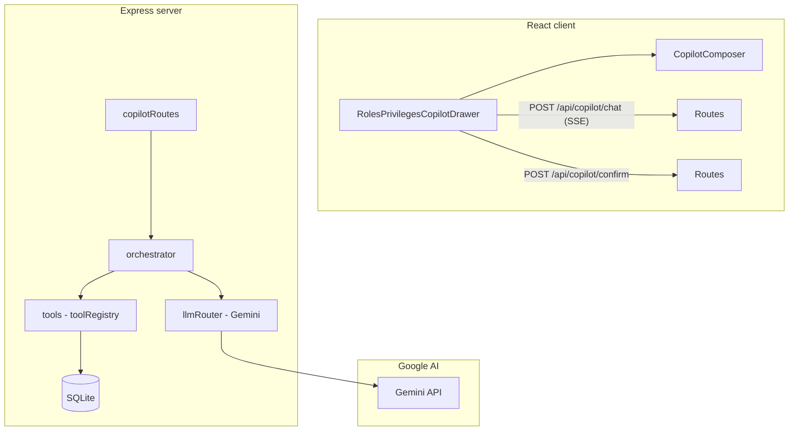

# Roles & Privileges Copilot — Architecture

This document describes how the **RBAC Copilot** in the Exotel Design Playground is built: high-level design, HTTP APIs, integrations (including how this relates to **MCP** / **Cursor**), and the **rules** that govern model + tool behavior.

---

## 1. Scope and stack

| Layer | Technology |
|-------|------------|
| UI | React (`RolesPrivilegesCopilotDrawer`, `CopilotComposer`), SSE client |
| Backend | Node + Express (`server/src`) |
| Persistence | SQLite (`better-sqlite3`) — roles, privilege sets, assignments, permission tree |
| Model | **Google Gemini** via `@google/generative-ai` with **function calling** |

The Copilot is **not** implemented with Model Context Protocol (MCP). It uses a custom **REST + Server-Sent Events (SSE)** chat pipeline and **Gemini tool (function) declarations** mapped to server-side handlers. **Cursor MCP** (e.g. Figma) is unrelated to this in-app RBAC Copilot unless you deliberately connect them in a separate workflow.

---

## 2. High-level design (HLD)



### 2.1 Request lifecycle

1. User submits a message (optional **@mentions** for role / privilege set / user IDs).
2. Client opens **SSE** stream on **`POST /api/copilot/chat`** with `conversation_id`, `message`, `mentions`, and `history`.
3. **`orchestrateCopilotChat`** builds Gemini **`Content[]`** from history + augmented user turn (mentions appended as structured lines).
4. **`generateCopilotTurn`** calls Gemini with **`functionDeclarations`** from `geminiFunctionDeclarations` (derived from **`toolRegistry`** in `copilot/tools.ts`).
5. If the model returns **function calls**, the orchestrator loops:
   - Emits SSE events (`tool_call_start`, etc.).
   - For **`isDestructive`** tools, waits for UI confirmation via **`POST /api/copilot/confirm`** before executing.
   - Executes **`executeToolNamed`** (Zod-validated args → SQLite / domain logic).
   - Appends **function responses** back into `contents` and calls the model again (up to **12** rounds).
6. Assistant text is streamed in chunks (`assistant_token`); final text via `assistant_message_complete`; stream ends with `done`.

### 2.2 Key modules (server)

| Path | Responsibility |
|------|----------------|
| `server/src/copilot/copilotRoutes.ts` | Registers `/api/copilot/chat` (SSE) and `/api/copilot/confirm` (JSON) |
| `server/src/copilot/copilotTypes.ts` | SSE event types, chat body shapes, mentions |
| `server/src/copilot/orchestrator.ts` | Multi-round loop, streaming tokens, destructive gating, idempotency, tool dispatch |
| `server/src/copilot/llmRouter.ts` | API keys, Gemini model config, **`COPILOT_SYSTEM_PROMPT`**, history → `Content[]`, append model/function turns |
| `server/src/copilot/tools.ts` | Zod schemas, **`ToolDefinition`**, Gemini declarations, **`executeToolNamed`**, destructive previews |
| `server/src/copilot/pendingConfirmations.ts` | In-memory **`waitForConfirmation` / `resolveConfirmation`** keyed by `(conversation_id, tool_call_id)` |
| `server/src/copilot/idempotency*.ts` | Cache for **non-destructive** tool results (SHA-256 key: conversation + tool + args) |
| `server/src/load-env.ts` | Loads `server/.env`; warns if Gemini keys missing |

### 2.3 Key modules (client)

| Path | Responsibility |
|------|----------------|
| `src/components/rbac/RolesPrivilegesCopilotDrawer.tsx` | Panel, timeline, SSE parsing, confirm dialogs, **`RBAC_LISTS_REFRESH_EVENT`** after mutating tools |
| `src/components/rbac/CopilotComposer.tsx` | Input, mentions, send pipeline |
| `src/types/copilot.ts` | Shared mention + history types |

**List refresh**: After successful tool completion, if the tool is **not** in **`COPILOT_READONLY_TOOLS`**, the drawer dispatches **`RBAC_LISTS_REFRESH_EVENT`** so User Management grids stay in sync. Read-only tools include search/list helpers (and **`list_permission_catalog`**).

---

## 3. HTTP APIs

### 3.1 `POST /api/copilot/chat`

- **Purpose**: Single user turn — returns a **streaming** response (`text/event-stream`).
- **Body** (JSON): validated by Zod in `copilotRoutes.ts`

```json
{
  "conversation_id": "uuid",
  "message": "string",
  "mentions": [
    { "entityType": "role" | "privilege_set" | "user", "id": "…", "label": "…" }
  ],
  "history": [
    { "role": "user", "content": "…", "mentions": [] },
    { "role": "assistant", "content": "…" }
  ]
}
```

- **Response**: SSE lines of the form  
  `data: {"type":"<CopilotSseType>","payload":...}`  

**SSE `type` values** (see `copilotTypes.ts`):  
`assistant_token`, `agent_thinking`, `tool_call_start`, `tool_call_end`, `tool_call_error`, `confirmation_required`, `assistant_message_complete`, `error`, `done`.

**`confirmation_required` payload**: includes `actionId` (matches tool call id), `preview` from `buildDestructivePreview`.

### 3.2 `POST /api/copilot/confirm`

- **Purpose**: Resume the orchestrator after the user confirms or cancels a **destructive** tool in the UI.
- **Body**:

```json
{
  "conversation_id": "uuid",
  "tool_call_id": "string",
  "confirmed": true | false
}
```

- **Response**: `{ "ok": true }` or `404` if no pending waiter.

Destructive tools (see §5) **`delete_role`** and **`unassign_user_from_role`** use this flow.

---

## 4. LLM integration (Gemini — not MCP)

### 4.1 Environment

Configured in **`server/.env`** (also re-hydrated in `load-env.ts`):

- **`GEMINI_API_KEY`** or **`GOOGLE_AI_API_KEY`** (required for Copilot)
- **`GEMINI_API_KEY_2` … `GEMINI_API_KEY_12`** — optional failover keys (`llmRouter.collectGoogleKeys`)
- **`GEMINI_MODEL`** — defaults e.g. `gemini-2.5-flash` if unset
- **`LLM_KEY_*`** + **`LLM_KEY_*_PROVIDER=google`** — optional extra Google keys

If no primary Gemini key exists, startup logs a warning that Copilot is effectively disabled until keys are added.

### 4.2 Tool surface

Tools are declared twice in sync:

1. **Gemini** `FunctionDeclaration` (`geminiDeclaration` per tool).
2. **Zod** `schemas.<toolName>` — parsed in `executeToolNamed` via `safeParse(JSON.parse(JSON.stringify(args)))`.

The **`COPILOT_SYSTEM_PROMPT`** in **`llmRouter.ts`** holds product **rules**: search-before-assign, tolerance for fuzzy names, use **`duplicate_role`** for clone, hierarchical privilege catalog for **`create_privilege_set`**, no invented IDs, in-app destructive confirmation only, etc.

### 4.3 MCP clarification

| Concept | Relation to RBAC Copilot |
|--------|---------------------------|
| **Cursor MCP servers** | Optional IDE integrations (e.g. Figma). Not used by `/api/copilot/chat`. |
| **MCP as a protocol** | This playground implements its own APIs + Gemini function calling instead of MCP. |
| **“MCP” in README / rules** | If documentation elsewhere mentions MCP, interpret it as **Cursor/product MCP**, not this Copilot’s transport. |

---

## 5. Tool registry overview

All tools live in **`server/src/copilot/tools.ts`**. Destructive tools set **`isDestructive: true`**.

**Read / search**

- `search_users` — Directory + assignment-aware user search (`userSearch.ts`).
- `search_privilege_sets` — Text / token ranking over privilege sets.
- `list_permissions` — Flat list of atomic permission labels (legacy / quick scan).
- `list_permission_catalog` — **Hierarchical** Monitor template: categories → subgroups → labels (`getMonitorCatalogTemplate` from `seed.ts`).
- `list_roles` — Optional name filter.

**Mutations**

- `create_role`, `duplicate_role`
- `assign_users_to_role` — Removes users from other roles first (`roleAssignments.removeUsersFromOtherRoles`).
- `create_privilege_set` — Full tree insert; supports **`grantAllInSubgroups`** / **`grantPermissionsInSubgroup`** via `privilegeCatalogMatch.ts`.
- `attach_privilege_set_to_role`, `detach_privilege_set_from_role`
- **`delete_role`** (destructive — confirm UI)
- **`unassign_user_from_role`** (destructive — confirm UI)

Many successful mutation responses include **`handoffPath`** (e.g. `/closed-interaction/user-management/roles/…`), which the drawer maps to navigation / “handoff” affordances.

---

## 6. Rules (canonical sources)

| Kind | Location |
|------|-----------|
| **Model behavior / product rules** | `server/src/copilot/llmRouter.ts` → `COPILOT_SYSTEM_PROMPT` |
| **Tool semantics & validation** | `server/src/copilot/tools.ts` (Zod + descriptions + `run`) |
| **Destructive confirmations** | `isDestructive` + `pendingConfirmations` + client timeline confirm state |
| **Cursor / AI authoring rules** | Workspace `.cursor/rules/*` — govern how *Cursor agents* edit code; distinct from Gemini system prompt |

When extending the Copilot:

1. Add Zod schema + `ToolDefinition` + `geminiDeclaration`.
2. If the tool is additive and safe to replay, **`isDestructive: false`** (idempotency cache applies).
3. If the tool deletes or materially revokes access, **`isDestructive: true`** and extend **`buildDestructivePreview`**.
4. Update **`COPILOT_SYSTEM_PROMPT`** so the model knows when/how to call the tool.
5. If the tool is read-only for RBAC grids, add its name to **`COPILOT_READONLY_TOOLS`** in `RolesPrivilegesCopilotDrawer.tsx` so grids are not unnecessarily refreshed.

---

## 7. Operational notes

- **Single-instance confirmation map**: `pendingConfirmations` is **in-memory**; multiple server replicas would need a shared store for confirm flow.
- **Idempotency cache**: In-memory **`Map`**; process restart clears it.
- **CORS**: Enabled with `origin: true` in `index.ts` for API access from dev clients.

---

*Last updated from codebase paths under `Exotel-Design-Playground/` (server + src).*
